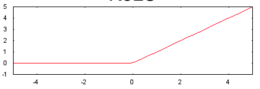

# Neural Networks
## **Basic Idea**
Think of a neural network as a machine that takes in several inputs (or "features") and determines the likelyhood that the output is going to be any of the accepted outputs. The network does this by creating layers of neurons which have a: set of inputs, activation function, bias, and output. The output in most cases become an input to the next layer.

## **Activation Functions**
Activation functions are functions that enable neural networks to learn nonlinear ("complex") relationships between features and lables.
### _ReLU_

### _Sigmoid_

## **Basic Idea**

## **Basic Idea**